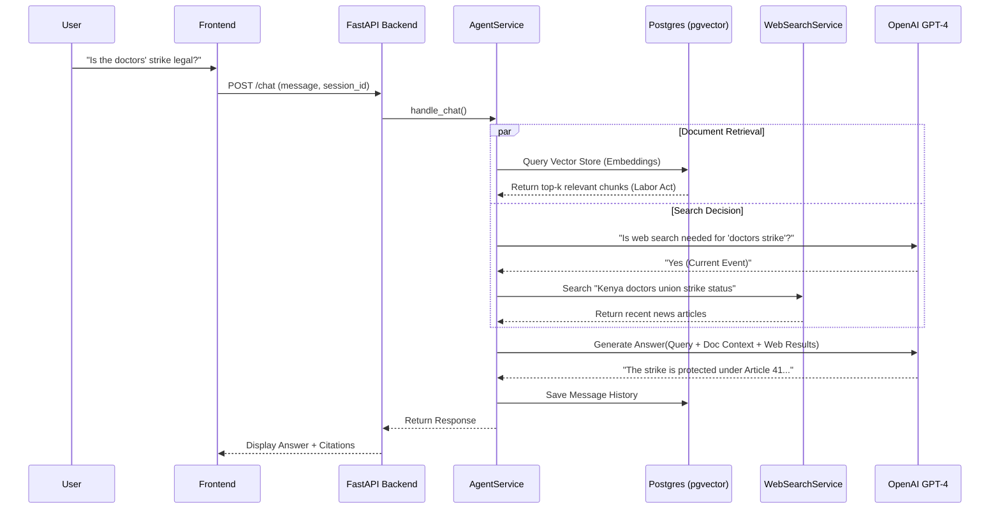
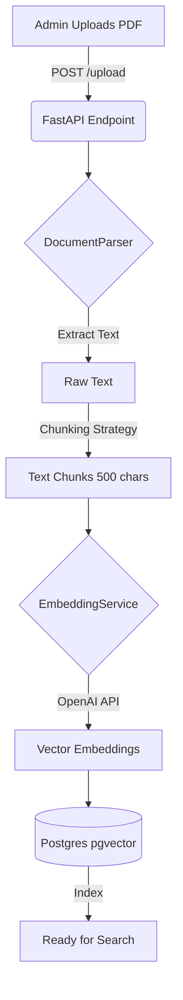

# Architecture - Know Your Rights Platform

## Overview
The "Know Your Rights" platform is a Retrieval-Augmented Generation (RAG) system designed to provide localized labor rights advice for Kenyan workers. It combines a knowledge base of legal documents with real-time web search and news scraping to deliver accurate, up-to-date legal insights.

## System Components

### 1. Frontend (Next.js 14)
*   **Role**: User interface for Chat, Admin Dashboard, and Document Management.
*   **Tech Stack**: React, TypeScript, TailwindCSS, Shadcn/UI.
*   **Key Features**:
    *   **Chat Interface**: Real-time streaming chat with markdown support.
    *   **Admin Dashboard**: secure area for uploading laws, monitoring usage, and configuring scrapers.
    *   **Auth**: JWT-based session management for admins.

### 2. Backend (FastAPI)
*   **Role**: Core API handling business logic, RAG pipeline, and Agent orchestration.
*   **Tech Stack**: Python 3.11, FastAPI, OpenAI SDK, Pydantic.
*   **Key Services**:
    *   `AgentService`: The central brain that routes queries between RAG (Documents) and Web Search.
    *   `RAGService`: Handles vector retrieval and context assembly.
    *   `DocumentParser`: Extracts text from PDFs/DOCX and chunks it.
    *   `NewsScraper`: Background service to fetch relevant labor news.

### 3. Database (PostgreSQL + pgvector)
*   **Role**: Primary data store for both relational data and vector embeddings.
*   **Extensions**: `pgvector` for storing 1536-dimensional embeddings.
*   **Key Tables**:
    *   `documents`: Metadata for uploaded laws/contracts.
    *   `document_chunks`: Text chunks + Vector Embeddings.
    *   `chat_sessions` & `messages`: Chat history state.

## Data Flow Diagrams

### Chat & RAG Pipeline
How a user query is processed to generate an answer.

### Document Ingestion Pipeline
How a PDF becomes searchable knowledge.

## Design Decisions

### Why PostgreSQL + pgvector?
*   **Simplicity**: We strictly avoided adding a separate vector database (like Pinecone or Weaviate) to keep the stack simple. Postgres allows us to join relational data (User/Session) with Vector data in a single query.
*   **Transactional Integrity**: Deleting a document atomically deletes all its chunks, ensuring no orphaned embeddings.

### Why Agentic Search?
*   **Problem**: RAG is static. If a strike happened today, the database wouldn't know.
*   **Solution**: The Agent dynamically decides if a query requires **external knowledge** (e.g., "current news") or **static knowledge** (e.g., "what does the law say").
*   **Implementation**: A lightweight LLM router examines the query before answering.

### Why Contextual Document Analysis?
*   **Flow**: Users often upload a contract and ask "Is this fair?".
*   **Approach**: We treat the uploaded document as a temporary addition to the context window, persisted in the session history, rather than indexing it into the global knowledge base. This preserves privacy and context relevance.
